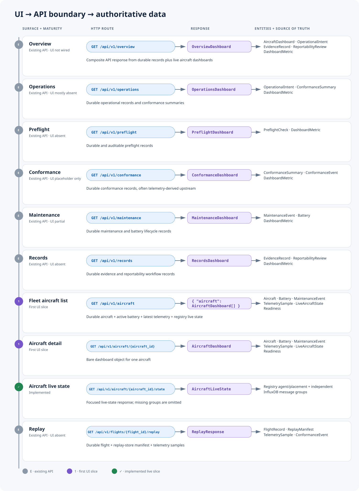
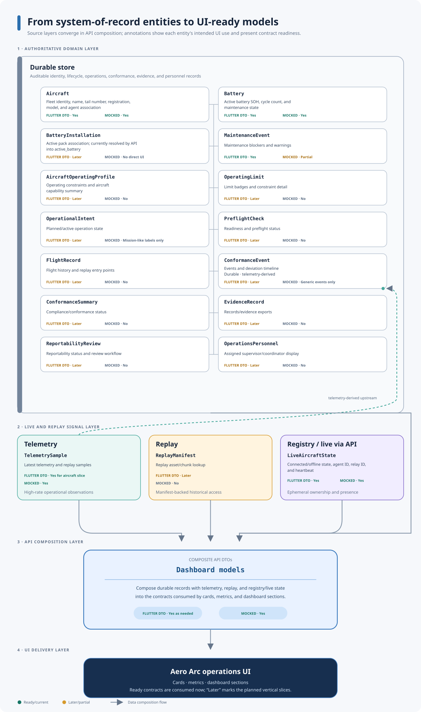
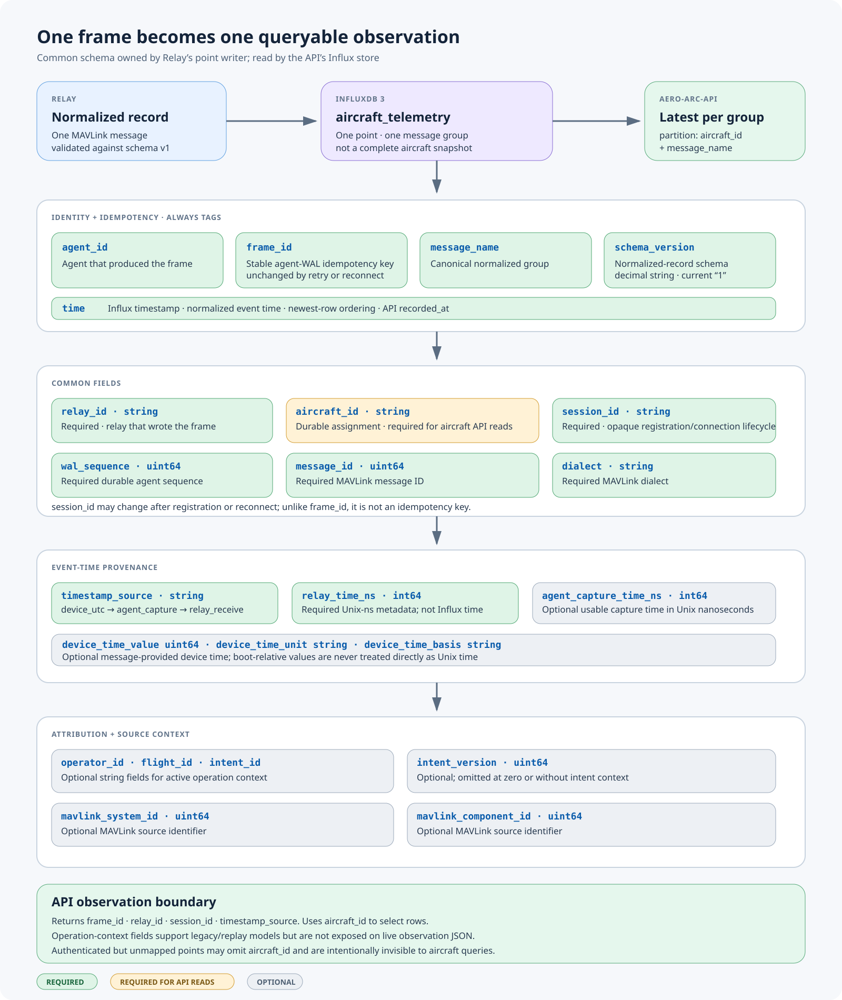
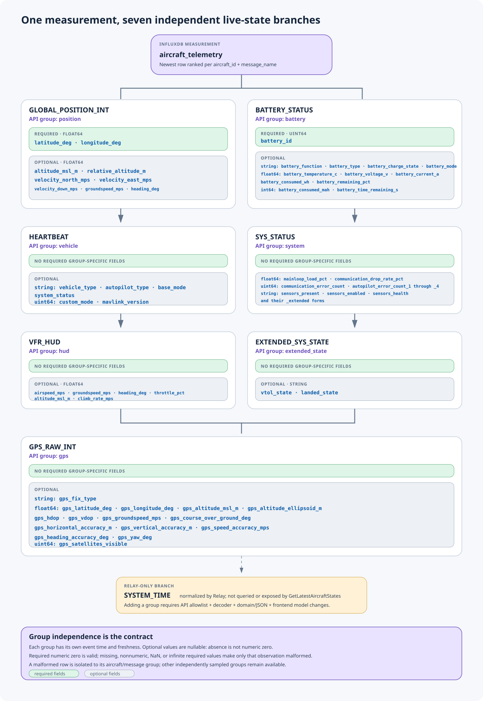

# UI Data Contract

This document defines how Aero Arc UI surfaces consume the `aero-arc-api`
product model. Frontends must call `aero-arc-api` only; they must not call
registry, relay, telemetry store, replay store, durable DB, or agent services
directly.

## Naming

- Use `aircraft` for durable vehicle identity and configuration.
- Use `agent` for the live software identity associated with an aircraft.
- Use `relay` for telemetry/control-plane routing placement.
- Use `operational_intent` for planned or authorized operations.
- Use `conformance_event` for operational envelope deviations.
- Use `evidence_record` for audit, export, and review artifacts.
- Use `readiness` for fly/no-fly dashboard status.

API JSON uses snake_case. Flutter/Dart DTO fields may use camelCase, but their
`fromJson` and `toJson` methods must map the exact API keys.

## Dashboard To API Mapping

## Entity To UI Mapping

## AircraftDashboard Vertical Slice

The first frontend slice uses the existing aircraft endpoints exactly as they
are implemented today:

- `GET /api/v1/aircraft` returns an envelope:
  `{ "aircraft": [AircraftDashboard...] }`
- `GET /api/v1/aircraft/{aircraft_id}` returns a bare `AircraftDashboard`.

The Flutter DTOs for this slice should mirror:

- `aircraft`
- `active_battery`
- `maintenance_events`
- `latest_telemetry`
- `telemetry`
- `live_state`
- `live_state_available`
- `readiness`
- `current_intent`

UI-only labels, colors, formatted dates, maintenance summaries, and telemetry
summaries must live in frontend view-model/helper code, not in API DTOs.

## Live Aircraft Contract

`GET /api/v1/aircraft/{aircraft_id}/state` and each entry in
`OperationsDashboard.live_aircraft` contain durable identity plus:

- `connection`: registry status, heartbeat, and placement. Status is
  `connected`, `stale`, `offline`, `unmapped`, or `unavailable`.
- `telemetry`: aggregate status and nullable `position`, `battery`, `vehicle`,
  `system`, `hud`, `extended_state`, and `gps` observations.
- Every telemetry observation has its own `recorded_at` and `status`; consumers
  must not assume independently emitted MAVLink messages share a sample time.
- Optional numeric fields distinguish an absent InfluxDB column from a valid
  zero. UI DTOs should therefore use nullable numbers for optional fields.

By default a registry heartbeat is connected through 30 seconds and a
telemetry observation is fresh through 15 seconds. These server-side policies
are configurable. The aggregate telemetry status describes its newest
observation; render group status when showing a specific value.

Live-state InfluxDB ranking is restricted to a five-minute lookback by default,
configured by `AERO_API_TELEMETRY_LATEST_LOOKBACK`. The lookback must be at
least the telemetry freshness window. Once a group falls outside the lookback
it is `missing`, not indefinitely `stale`; replay/history queries are separate
and are not restricted by the live-state lookback.

## Relay To InfluxDB Telemetry Contract

The source of truth for writes is the `Aero-Arc/aero-arc-relay` repository:
`internal/telemetrywriter/influx/point.go` owns the InfluxDB point layout,
`internal/telemetrynormalize/normalizers.go` owns normalization, and
`docs/telemetry-normalization-fields-v1.md` owns conversions and validity
ranges. The API read side is implemented by
`internal/store/telemetry/influxdb/store.go`. A change to any name or type in
this section must update and test both repositories.

Relay writes the InfluxDB measurement `aircraft_telemetry`. Each point is one
normalized MAVLink message, not a complete aircraft snapshot. InfluxDB `time`
is the normalized event time selected by Relay; API exposes it as that group's
`recorded_at` and selects the newest row independently for each
`aircraft_id`/`message_name` pair. Relay chooses a validated device UTC time
first, then agent capture time, then relay receive time; `timestamp_source` is
respectively `device_utc`, `agent_capture`, or `relay_receive`. A boot-relative
device timestamp is never treated directly as Unix time.

### Tags and common columns

The API currently returns `frame_id`, `relay_id`, `session_id`, and
`timestamp_source` on each observation. It uses `aircraft_id` to select rows;
operation-context columns support legacy/replay models but are not exposed on
the live observation JSON.

### Message groups read by the API

All fields below are InfluxDB fields. `float64`, `uint64`, and `int64` describe
the normalized value type written by Relay. Except where marked required, a
field is optional and omitted when the source value is absent, a MAVLink
sentinel, out of range, or not representable.

Relay also normalizes `system_time`, but `GetLatestAircraftStates` does not
currently query or expose it. Adding a message group requires adding it to the
API query allowlist, decoder, domain/JSON contract, and frontend model rather
than relying on `SELECT *` alone.

Required fields are validated as genuinely numeric: numeric zero is valid,
while missing, nonnumeric, NaN, or infinite required values make only that
observation malformed. Optional numeric fields are nullable in API JSON so an
omitted column is never coerced to zero. A malformed row is isolated to its
aircraft/message group; independently sampled valid groups remain available.

## Live Conformance Contract

`GET /api/v1/operations` and `GET /api/v1/conformance` batch-read current live
Conformance projections from Registry using the deterministic
`assignment_id == intent_id` contract. The API never performs one Registry call
per intent. Missing, expired, unavailable, or not-yet-implemented Registry
projections do not fail either dashboard.

Each summary preserves the legacy durable fields (`id`, `operator_id`,
`intent_id`, `intent_version`, `flight_id`, `aircraft_id`, `status`, `score`,
`alert_count`, `reportability_status`, and `updated_at`) and may add these live
fields:

- `assignment_id`, `assignment_generation`
- `evaluation_revision`, `evaluation_id`
- `condition`: `unknown`, `conforming`, `suspected`, `non_conforming`, or
  `recovering`
- `monitoring_status`: `received`, `armed`, `current`, `stale`, or `unavailable`
- `recording_status`: `pending`, `confirmed`, or `degraded`
- `observed_at`, `frame_id`
- `violations`: current violation summaries containing `violation_type`,
  `phase`, optional opening/observation timestamps and frame identity, and
  `worst_deviation_m`

Registry is the replaceable source for current state, not incident history.
The `events` array in the Conformance dashboard and durable legacy fields such
as score, alert count, and reportability remain sourced from the API store. A
live projection for the same intent version overlays its current condition and
cursor fields without erasing those durable values. A live-only projection is
also returned so a no-seed flight appears immediately. The API maps the live
condition onto legacy `status` for older clients: conforming and non-conforming
map directly, suspected/recovering map to contingent, and unknown maps to
unknown.

## Known Gaps

- `AircraftDashboard.operating_profile` exists but is not currently populated
  by `FleetService`.
- `LiveAircraftState` does not include location; latest position comes from
  `telemetry.position` (with `latest_telemetry` retained for compatibility).
- Aircraft cards do not yet receive latest preflight or conformance summaries
  directly; consumers must use the broader dashboard endpoints for now.
- `DashboardMetric` uses display labels and string values, not stable metric
  IDs, so UI logic should not depend on metric labels as identifiers.
